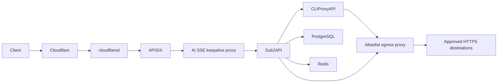

# AI Gateway

Reusable Docker Compose stack for [CLIProxyAPI](https://github.com/router-for-me/CLIProxyAPI), [Sub2API](https://github.com/Wei-Shaw/sub2api), [Apache APISIX](https://apisix.apache.org/), [ai-sse-keepalive-proxy](https://github.com/xz-dev/ai-sse-keepalive-proxy), [Squid](https://www.squid-cache.org/), [socat](http://www.dest-unreach.org/socat/), and [Cloudflare Tunnel](https://developers.cloudflare.com/cloudflare-one/networks/connectors/cloudflare-tunnel/).

It separates provider credentials, client API-key authority, public routing, and Internet ingress:



## Security model

- **Sub2API is the only client API-key authority.** APISIX never validates client keys.
- APISIX exposes an AI-method/path allowlist. Management, login, health, and unknown routes are not public.
- `ai-sse-keepalive-proxy` is AI SSE protocol-specific, not a generic arbitrary-SSE transformer. It recognizes streaming OpenAI Responses, OpenAI Chat Completions, and Anthropic Messages framing. Placement after APISIX lets APISIX remain sole public security boundary while proxy owns parser-visible startup/idle writes during silent upstream periods.
- APISIX reaches middleware only through `apisix-ai-sse-relay`; middleware reaches Sub2API only through `ai-sse-sub2api-relay`. APISIX and Sub2API share no network. Sub2API trusts forwarded IP headers only from outgoing relay target `172.30.26.3/32`, preserving APISIX-sanitized forwarding headers through middleware.
- APISIX admits 10 requests/second per client with a 40-request burst and at most 50 concurrent requests; excess traffic receives an immediate neutral `429` without delay.
- Request bodies are capped at 16 MiB and rejected with a neutral `413` before reaching Sub2API.
- Public final `401` and all final `404` responses become the same zero-byte `404`; other statuses and successful, SSE, and WebSocket responses remain transparent.
- APISIX strips Sub2API's private `X-Client-Request-ID` and preserves standard `X-Request-ID` on non-opaque responses.
- Sub2API accepts forwarded client IPs only through AI SSE middleware's outgoing relay, after APISIX sanitizes them. Its URL allowlist stays disabled because CPA uses an internal HTTP URL; Docker pairwise networks provide the service-reachability boundary instead.
- CPA, Sub2API admin access, and APISIX bind to loopback by default.
- Every directed TCP edge has one independent version- and digest-pinned `alpine/socat` relay. Its source and target sides use separate networks, so sources can initiate through the relay but targets cannot open a new connection back. TCP remains full duplex after connection establishment, preserving OAuth, SSE, WebSocket, and 600-second requests. No relay exposes an API or reverse mode. Production currently has no UDP edge; UDP is enabled only when an actual UDP port contract exists.
- Every internal relay network has exactly two Compose members; no service uses Compose's default network. CPA, Sub2API, APISIX, and AI SSE middleware share networking with minimal Alpine namespace owners that delete all default routes and drop privilege. Separate host-ingress namespace owners hold published ports and the source/target sides of their dedicated socat relays. This remains portable across rootless Podman and rootful Docker without host firewall changes or engine-specific bridge options.
- CPA and Sub2API have no direct Internet route. Each reaches Squid only through its own source/target socat relay pair. Squid alone joins `proxy-egress`; cloudflared alone joins its egress network and reaches APISIX only through its own relay. APISIX has no Internet route.
- Production-only services such as ZCode stay out of the reusable Compose file. An ignored `compose.override.yaml` may add the official digest-pinned ZCode image behind digest-pinned `tun2proxy`. ZCode shares the tunnel namespace, TUN routes, and virtual DNS. CPA→ZCode and ZCode→Squid each cross an independent two-network socat relay, so transports that ignore proxy variables still reach Squid without a downstream ZCode fork.
- Egress policy is fail-closed. Every HTTPS tunnel must pass service/source, CONNECT domain, exact ClientHello SNI-to-CONNECT matching, and resolved private/reserved-address denial. Squid resolves only through an in-container Unbound instance that strips unsafe answers before caching, including mixed and rebinding responses. `bump` destinations additionally require exact decrypted Host-to-SNI matching plus method/path ACLs. `splice` destinations retain end-to-end TLS fingerprints but cannot expose encrypted Host/path to Squid.
- TLS inspection uses a locally generated CA. Its private key is mounted only into Squid; CPA, Sub2API, and optional ZCode receive only a public trust bundle. Upstream certificate validation remains enabled.
- Every external runtime image is pinned by manifest digest; upgrades require an explicit digest change. Every container has PID, memory, CPU, capability, and log-size bounds. Root filesystems are read-only where runtime evidence showed no required overlay writes; APISIX and Sub2API retain writable roots for generated configuration and request handling.
- Cloudflare Tunnel receives its token from the ignored mode-`0600` `.env`, never from tracked Compose or config files.

## Quick start

Requirements: Linux with `/dev/net/tun`, Docker Engine with Compose v2.33.1+ for production or rootless Podman with a Compose provider for local operation, OpenSSL, and a remotely managed Cloudflare Tunnel. The same Compose uses only container-local shared namespaces, temporary route-setup capabilities, virtual DNS, and the TUN device; it never changes host firewall or routing state.

```bash
git clone --recurse-submodules https://github.com/xz-dev/AI-gateway.git /root/AI-gateway
cd /root/AI-gateway
./scripts/init.sh
```

`init.sh` generates private values without printing them. It refuses to overwrite an existing `.env` or `data/cpa/conf/config.yaml`.

1. Replace `ADMIN_EMAIL=admin@example.invalid` in `.env`.
2. In Cloudflare Dashboard, create a remotely managed Tunnel and replace `CLOUDFLARED_TUNNEL_TOKEN` in `.env` using an editor that does not expose it in shell history. Keep `.env` mode `0600`.
3. Add the minimum required destinations to `data/egress-proxy/policy.json`, then render it. This ignored runtime file is created only when absent, so repository upgrades never replace the user's allowlist:

   ```bash
   ./scripts/init-egress-proxy.sh
   ```

   The generated policy initially denies all egress. Use `tls: "bump"` with explicit methods and anchored POSIX path expressions. Use `tls: "splice"` only when preserving end-to-end TLS behavior is required; splice entries cannot enforce HTTP Host/path.
4. Validate and start. Compose builds `ai-sse-keepalive-proxy:latest` locally from pinned submodule `middleware/ai-sse-keepalive-proxy`; it never pulls middleware from GHCR:

   ```bash
   git submodule update --init --recursive
   ./scripts/validate.sh
   docker compose pull cli-proxy-api postgres redis sub2api apisix cloudflared
   docker compose build ai-sse-keepalive-proxy
   docker compose up -d --build --wait
   docker compose ps
   ```

   On rootless Podman installations without automatic healthcheck scheduling (for example OpenRC), use the same Compose with `docker compose up -d --build`; do not use `--wait`. `./scripts/validate.sh` performs explicit runtime probes instead of relying on engine health timers.

## Cloudflare Tunnel

Create a Public Hostname in Cloudflare Dashboard with this origin service:

```text
http://apisix-ingress:9080
```

Do not point the Tunnel directly at Sub2API or CPA. Configure a Cache Rule that bypasses cache for the API hostname. Cloudflare-side changes remain operator-owned; this repository stores no account ID, tunnel ID, hostname, or token.

The Compose service uses Cloudflare's supported `TUNNEL_TOKEN` environment variable. This is portable across Docker Compose implementations and avoids an unreadable UID-mismatched file secret. Docker daemon administrators can inspect container environments, so protect daemon access as root-equivalent. No local `cloudflared` ingress file is needed because hostname routing is managed in Cloudflare Dashboard.

## Configure egress policy

Example bumped destination (documentation only; it is not enabled by the default deny-all policy):

```json
{
  "domain": "api.openai.com",
  "tls": "bump",
  "methods": ["POST"],
  "paths": ["^/v1/(responses|chat/completions|embeddings)($|[?])"]
}
```

Example TLS-preserving destination:

```json
{
  "domain": "subscription.example.com",
  "tls": "splice"
}
```

Optional components need their own `GET`/`bump` entries; none of these are enabled automatically:

| Component | Exact domain | Anchored path |
|---|---|---|
| CPA metadata plugin | `models.dev` | `^/api\\.json($|[?])` |
| CPA metadata plugin | `modelparams.dev` | `^/api/v1/models\\.json($|[?])` |
| CPA version check | `api.github.com` | `^/repos/router-for-me/CLIProxyAPI/releases/latest($|[?])` |
| Sub2API version check | `api.github.com` | `^/repos/Wei-Shaw/sub2api/releases/latest($|[?])` |
| Sub2API Codex version sync | `api.github.com` | `^/repos/openai/codex/releases/latest($|[?])` |

Add any fallback list endpoint, model registry, management UI, or plugin release repository as another exact path only when that feature is used. Never replace these with a repository wildcard.

Domain entries may be exact names or start with `.` to include subdomains. A domain may have multiple `bump` entries when different paths require different methods, but it cannot mix `bump` and `splice`. IP literals, plaintext HTTP, missing SNI, CONNECT ports other than 443, unlisted redirects, unknown methods/paths, private/link-local/loopback/CGNAT/documentation/multicast/reserved destinations, and malformed upstream certificates fail closed. Never allow all of GitHub: add only the exact repository API, raw-content, or release paths a configured component actually reads. Re-run `./scripts/init-egress-proxy.sh` after every policy edit, then validate and recreate Squid with its dependent clients together.

## Configure CPA and Sub2API

CPA listens at `http://127.0.0.1:8317` by default. Its management UI/API requires the private `CPA_MANAGEMENT_KEY` stored in `.env`. OAuth callback ports are also loopback-only. Use SSH port forwarding rather than changing them to `0.0.0.0` on a remote host.

CPA's global `proxy-url` forces provider transports through Squid. If an OpenAI-compatible entry targets another service on a pairwise internal network, set that entry's `api-key-entries[].proxy-url` to `direct`; otherwise the global proxy would incorrectly receive the internal HTTP request. Do not use `direct` for Internet destinations—the CPA container has no direct Internet route.

Add provider accounts to CPA, then create an OpenAI-compatible upstream account in Sub2API:

| Field | Value |
| --- | --- |
| Base URL | `http://cli-proxy-api:8317/v1` |
| API key | private `CPA_API_KEY` value from `.env` |

Leave that internal CPA account without a Sub2API proxy. For every Sub2API account whose Base URL is on the Internet, explicitly assign an active `http` proxy record pointing to `sub2api-egress-relay:3128` with fallback mode `none`; Sub2API's account transports do not consistently inherit proxy environment variables.

### Production-only ZCode

Do not maintain a downstream ZCode branch. Pin the official release image by manifest digest in the ignored `.env` and create the ignored production override with `./scripts/init-zcode-override.sh`. The override uses a `zcode-egress-tunnel` namespace owner based on the pinned `TUN2PROXY_IMAGE`, with `network_mode: service:zcode-egress-tunnel` on ZCode. The tunnel receives only `/dev/net/tun` and `NET_ADMIN`; it is not privileged and never changes host firewall or routing state.

Use `--dns virtual` and mount an ignored `data/egress-proxy/virtual-resolv.conf` containing only:

```text
nameserver 198.18.0.1
options ndots:0
```

Virtual DNS preserves the requested hostname for Squid CONNECT while preventing client-side DNS escape. Do not bind a host file over the tunnel owner's `/etc/resolv.conf`. The tunnel intentionally keeps only its disposable container layer writable because tun2proxy must rewrite Docker's runtime resolver file and clean up TUN state during startup and teardown; it has no persistent writable mount, remains unprivileged, and receives only `NET_ADMIN`. CPA reaches ZCode only through `cpa-zcode-relay`; the tunnel reaches Squid only through `zcode-squid-relay`. Each direction has separate two-member source and target networks, and a failed relay or tunnel loses connectivity instead of gaining direct Internet access.

The tunnel uses `restart: "no"` deliberately. A ZCode process keeps the shared network namespace alive after the tunnel owner exits, so restarting only the owner cannot safely remove stale TUN state. Rebuild the pair in order instead of using `docker compose restart`:

```bash
docker compose rm -s -f zcode-proxy
docker compose rm -s -f zcode-egress-tunnel
docker compose up -d --no-build zcode-egress-tunnel zcode-proxy
```

For the CPA entry targeting `http://zcode-proxy:8080/v1`, set `proxy-url: direct` on every item under that entry's `api-key-entries`; the provider object itself has no proxy field. The global CPA proxy is only for Internet destinations.

Sub2API admin UI is available at `http://127.0.0.1:8086`. For remote administration:

```bash
ssh -L 8086:127.0.0.1:8086 user@gateway-host
```

To retain direct Sub2API access over Tailscale, set `SUB2API_BIND_ADDRESS` to the host's specific Tailscale IP. Avoid `0.0.0.0` unless every host interface is intentionally trusted.

## Public API behavior

APISIX forwards the supported OpenAI, Anthropic, Gemini, Codex, Antigravity, image, audio, video, realtime, and compatible root routes defined in [`apisix/apisix.yaml`](apisix/apisix.yaml).

Opaque responses are protocol-correct:

- HTTP/1.1 may retain transport framing such as `Connection` and `Transfer-Encoding` while sending zero body bytes.
- HTTP/2 and HTTP/3 do not expose HTTP/1.1 framing headers.
- Content, authentication, product, application, and request-ID headers are removed from opaque `404` responses.

When upgrading Sub2API, re-audit that provider/upstream authentication failures are translated before reaching APISIX; otherwise the final-`401` masking rule could hide an upstream outage. Revalidate header filtering after every APISIX/OpenResty upgrade.

## Operations

Sub2API, CLIProxyAPI, AI SSE keepalive proxy, their namespace owners, and every adjacent socat relay are one operational unit. Restart propagation is not reliable across shared namespaces and relay chains. Never use `docker restart`, never recreate a namespace owner alone, and never recreate CPA without Sub2API. With the production override, include the ZCode tunnel and both ZCode relays in the same full-stack operation.

```bash
# Follow all stack and relay logs
docker compose logs -f

# Apply an image, policy, relay, or namespace change as one coupled recreation
docker compose up -d --build --wait --force-recreate

# Stop and restart the complete stack without deleting bind-mounted data
docker compose down
docker compose up -d --build --wait
```

Persistent application state lives under ignored `data/`, including the egress CA/policy, CPA config/auth/logs/plugins/runtime SQLite, and Sub2API PostgreSQL/Redis/application data. Back it up before upgrades. Never commit `.env` or `data/`. Losing the egress CA breaks trust for bumped destinations; never rotate it as part of a routine redeploy.

## Validation

```bash
./scripts/validate.sh              # private runtime config after init
./scripts/validate.sh .env.example # tracked template only
```

Validation renders Compose and enforces exact per-edge socat commands, two-member source/target membership, fixed internal addresses, nonroot/read-only/capability-free relays, AI SSE middleware submodule/gitlink/local build/image metadata, engine-neutral host publication, startup wrappers, external image digests, and sole-egress membership. Base rendering has 26 services and 24 networks; optional ZCode rendering has 30 services and 28 networks. `test-socat-boundary.sh` proves TCP and UDP forwarding, 256 simultaneous held-open TCP connections, blocked target→source initiation, zero effective relay capabilities, and cleanup. The 512-PID/64-MiB relay bounds leave parent and supervisor headroom above that tested capacity; UDP remains test-only until a real production UDP contract exists. The egress tests keep exact `/dev/net/tun`+`NET_ADMIN` by default; hosted CI labels an explicit privileged runtime-test mode while static Compose validation still rejects privileged production services.

## Layout

```text
.
├── apisix/
│   ├── apisix.yaml       # standalone routes and public response policy
│   ├── config.yaml       # APISIX data-plane configuration
│   └── lua/              # production custom Lua modules
├── cpa/
│   └── config.example.yaml
├── egress-proxy/
│   ├── Dockerfile
│   ├── unbound.conf         # filtered resolver used only by Squid
│   ├── policy.example.json # copied as a deny-all runtime policy
│   └── testdata/
├── data/                   # ignored persistent runtime state
│   ├── cpa/
│   ├── egress-proxy/
│   └── sub2api/
├── middleware/
│   └── ai-sse-keepalive-proxy/ # pinned submodule, built locally by Compose
├── scripts/
│   ├── init.sh
│   ├── init-egress-proxy.sh
│   ├── init-zcode-override.sh
│   ├── render-egress-policy.py
│   ├── test-egress-proxy.sh
│   ├── test-netns-guard.sh
│   ├── test-socat-boundary.sh
│   └── validate.sh
├── .env.example
└── compose.yaml
```

## License

This deployment template is licensed under the [MIT License](LICENSE). Container images and upstream applications retain their own licenses.
