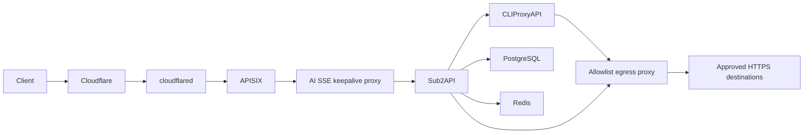

# AI Gateway

Model inventory synchronization: [cpa-model-sync usage and policy migration](cpa-model-sync/README.md).
The Rust sidecar manages only the five supported API-key kinds through CPA's internal
Management API. Gemini/Interactions retain Go inventory behavior; Go metadata,
OAuth/native visibility, static aliases and downstream authorization remain separate.

Reusable Docker Compose stack for [CLIProxyAPI](https://github.com/router-for-me/CLIProxyAPI), [Sub2API](https://github.com/Wei-Shaw/sub2api), [Apache APISIX](https://apisix.apache.org/), [ai-sse-keepalive-proxy](https://github.com/xz-dev/ai-sse-keepalive-proxy), [Squid](https://www.squid-cache.org/), [socat](http://www.dest-unreach.org/socat/), and [Cloudflare Tunnel](https://developers.cloudflare.com/cloudflare-one/networks/connectors/cloudflare-tunnel/).

It separates provider credentials, client API-key authority, public routing, and Internet ingress:



> [!WARNING]
> **An external firewall or cloud security group is a deployment prerequisite for every intentionally public host port.** The tracked defaults bind host-published ports to `127.0.0.1`. If that external boundary is unavailable, keep every `*_BIND_ADDRESS` on loopback or a specific trusted interface and never change it to `0.0.0.0`. Container-internal listeners do not make a host port public; Compose `ports` bindings do.

## Security model

- **Sub2API is the only client API-key authority.** APISIX never validates client keys.
- APISIX exposes an AI-method/path allowlist. Management, login, health, and unknown routes are not public.
- `ai-sse-keepalive-proxy` is AI SSE protocol-specific, not a generic arbitrary-SSE transformer. It recognizes streaming OpenAI Responses, OpenAI Chat Completions, and Anthropic Messages framing. Placement after APISIX lets APISIX remain sole public security boundary while proxy owns parser-visible startup/idle writes during silent upstream periods.
- APISIX reaches middleware only through `apisix-ai-sse-relay`; middleware reaches Sub2API only through `ai-sse-sub2api-relay`. APISIX and Sub2API share no network. Sub2API trusts forwarded IP headers only from outgoing relay target `172.30.26.3/32`, preserving APISIX-sanitized forwarding headers through middleware.
- APISIX keys limits on each resolved real client IP: 10 requests/second with a 40-request burst, at most 50 concurrent requests, and a hard 300 requests per 60-second local window. Excess traffic receives an immediate neutral `429`; the long-window limit cannot degrade open and emits no quota headers.
- Request bodies are capped at 16 MiB and rejected with a neutral `413` before reaching Sub2API.
- Public final `401` and all final `404` responses become the same zero-byte `404`; other statuses and successful, SSE, and WebSocket responses remain transparent.
- APISIX strips Sub2API's private `X-Client-Request-ID` and preserves standard `X-Request-ID` on non-opaque responses.
- Sub2API accepts forwarded client IPs only through AI SSE middleware's outgoing relay, after APISIX sanitizes them. Its URL allowlist stays disabled because CPA uses an internal HTTP URL; Docker pairwise networks provide the service-reachability boundary instead.
- CPA, Sub2API admin access, and APISIX bind to loopback by default.
- Every directed TCP edge has one independent explicit-version `alpine/socat` relay. Its source and target sides use separate networks, so sources can initiate through the relay but targets cannot open a new connection back. TCP remains full duplex after connection establishment, preserving OAuth, SSE, WebSocket, and 600-second requests. No relay exposes an API or reverse mode. The base template declares TCP edges only.
- Every internal relay network has exactly two Compose members; no service uses Compose's default network. CPA, Sub2API, APISIX, and AI SSE middleware share networking with minimal Alpine namespace owners that delete all default routes and drop privilege. Separate host-ingress namespace owners hold published ports and the source/target sides of their dedicated socat relays. This remains portable across rootless Podman and rootful Docker without host firewall changes or engine-specific bridge options.
- CPA and Sub2API have no direct Internet route. Each reaches Squid only through its own source/target socat relay pair. Squid alone joins `proxy-egress`; cloudflared alone joins its egress network and reaches APISIX only through its own relay. APISIX has no Internet route.
- An optional `provider-sidecar` stays out of the reusable base Compose file. This is a generic role for an explicit-version OpenAI-compatible service whose runtime-specific image, environment, mounts, command, healthcheck, domains, models, and credentials exist only in ignored production state. The generated override supplies reusable TLS, shared-TUN, virtual-DNS, relay, and Squid boundaries without naming or embedding a concrete provider.
- Egress policy is fail-closed. Every HTTPS tunnel must pass service/source, CONNECT domain, exact ClientHello SNI-to-CONNECT matching, and resolved private/reserved-address denial. Squid resolves only through an in-container Unbound instance that strips unsafe answers before caching, including mixed and rebinding responses. `bump` destinations additionally require exact decrypted Host-to-SNI matching plus method/path ACLs. `splice` destinations retain end-to-end TLS fingerprints but cannot expose encrypted Host/path to Squid.
- TLS inspection uses a locally generated CA. Its private key is mounted only into Squid; CPA, Sub2API, and optional provider-sidecar receive only a public trust bundle. Upstream certificate validation remains enabled.
- Every image uses an explicit non-floating version tag; digest references and `latest` are rejected by validation. Every container has PID, memory, CPU, capability, and log-size bounds. Root filesystems are read-only where runtime evidence showed no required overlay writes; APISIX and Sub2API retain writable roots for generated configuration and request handling.
- Cloudflare Tunnel receives its token from the ignored mode-`0600` `.env`, never from tracked Compose or config files.

## Quick start

Requirements: Linux with `/dev/net/tun`, either Docker Engine with Compose v2.33.1+ or rootless Podman with a Compose provider, OpenSSL, and a remotely managed Cloudflare Tunnel. Scripts automatically select a running Docker or Podman engine; no `docker` compatibility shim is required. The same Compose uses only container-local shared namespaces, temporary route-setup capabilities, virtual DNS, and the TUN device; it never changes host firewall or routing state.

```bash
git clone --recurse-submodules https://github.com/xz-dev/AI-gateway.git "$HOME/AI-gateway"
cd "$HOME/AI-gateway"
./scripts/init.sh
```

`init.sh` generates private values without printing them. It refuses to overwrite an existing `.env` or `data/cpa/conf/config.yaml`.

1. Replace `ADMIN_EMAIL=admin@example.invalid` in `.env`.
2. In Cloudflare Dashboard, create a remotely managed Tunnel and replace `CLOUDFLARED_TUNNEL_TOKEN` in `.env` using an editor that does not expose it in shell history. Keep `.env` mode `0600`.
3. Review the built-in control-plane rules in `data/egress-proxy/policy.json`, add only the deployment-specific provider or optional-feature destinations you need, then render it. This ignored runtime file is created only when absent, so repository upgrades never merge into or replace the user's allowlist:

   ```bash
   ./scripts/init-egress-proxy.sh
   ```

   The generated policy allows only the exact CPA and Sub2API control-plane `GET` requests documented below; provider, OAuth, plugin, private-sidecar, and user-defined egress remains denied. Use `tls: "bump"` with explicit methods and anchored POSIX path expressions. Use `tls: "splice"` only when preserving end-to-end TLS behavior is required; splice entries cannot enforce HTTP Host/path.
4. If production uses an optional provider-sidecar, add an explicit non-floating version-tagged `PROVIDER_SIDECAR_IMAGE`, non-root `PROVIDER_SIDECAR_USER`, and `PROVIDER_SIDECAR_API_KEY` only to the ignored `.env`. Initialize dedicated internal TLS, generate the ignored transport override, then add the image-specific environment, mounts, command, and healthcheck to that private override:

   ```bash
   ./scripts/init-provider-sidecar-tls.sh
   ./scripts/init-provider-sidecar-override.sh
   ```

   The public contract is intentionally narrow: the sidecar is OpenAI-compatible at `/v1`, listens on plain HTTP port `8080` inside its shared tunnel namespace, publishes no host port, runs as the declared non-root user, and obtains all Internet access through TUN → relay → Squid. The generator does not know or store any vendor-specific runtime setting.

5. Validate and start. Compose builds `ai-sse-keepalive-proxy:v0.1.0` locally from tagged, pinned submodule `middleware/ai-sse-keepalive-proxy`; it never pulls middleware from GHCR:

   ```bash
   git submodule update --init --recursive
   ./scripts/validate.sh
   source ./scripts/container-runtime.sh
   "${AI_GATEWAY_COMPOSE[@]}" pull cli-proxy-api postgres redis sub2api apisix cloudflared
   "${AI_GATEWAY_COMPOSE[@]}" up -d --build
   "${AI_GATEWAY_COMPOSE[@]}" ps
   ```

   Do not rely on `--wait`: rootless Podman installations without automatic healthcheck scheduling (for example OpenRC) may leave health at `starting`. `./scripts/validate.sh` performs explicit runtime probes instead of relying on engine health timers.

## Cloudflare Tunnel

Create a Public Hostname in Cloudflare Dashboard with this origin service:

```text
http://apisix-ingress:9080
```

Do not point the Tunnel directly at Sub2API or CPA. Configure a Cache Rule that bypasses cache for the API hostname. Cloudflare-side changes remain operator-owned; this repository stores no account ID, tunnel ID, hostname, or token.

The Compose service uses Cloudflare's supported `TUNNEL_TOKEN` environment variable. This is portable across Docker Compose implementations and avoids an unreadable UID-mismatched file secret. Docker daemon administrators can inspect container environments, so protect daemon access as root-equivalent. No local `cloudflared` ingress file is needed because hostname routing is managed in Cloudflare Dashboard.

## Configure egress policy

Fresh installations start with a control-plane-only policy. Every entry below is enabled for the named service, uses `GET` with `tls: "bump"`, and matches only the listed domain and JSON path expression:

| Service | Component | Exact domain | Anchored path |
|---|---|---|---|
| CPA | Core version check | `api.github.com` | `^/repos/router-for-me/CLIProxyAPI/releases/latest$` |
| CPA | Management Center release metadata | `api.github.com` | `^/repos/router-for-me/Cli-Proxy-API-Management-Center/releases/latest$` |
| CPA | Management Center browser download | `github.com` | `^/router-for-me/Cli-Proxy-API-Management-Center/releases/download/[^/]+/management\\.html$` |
| CPA | Management Center release asset | `release-assets.githubusercontent.com` | `^/github-production-release-asset/1051566067/` |
| CPA | Model catalog | `raw.githubusercontent.com` | `^/router-for-me/models/refs/heads/main/models\\.json$` |
| CPA | Codex client model catalog | `raw.githubusercontent.com` | `^/router-for-me/models/refs/heads/main/codex_client_models\\.json$` |
| Sub2API | Core version check | `api.github.com` | `^/repos/Wei-Shaw/sub2api/releases/latest$` |
| Sub2API | Codex latest release | `api.github.com` | `^/repos/openai/codex/releases/latest$` |
| Sub2API | Codex stable-release fallback | `api.github.com` | `^/repos/openai/codex/releases\\?per_page=30$` |
| Sub2API | Pricing data | `raw.githubusercontent.com` | `^/Wei-Shaw/model-price-repo/main/model_prices_and_context_window\\.json$` |
| Sub2API | Pricing hash | `raw.githubusercontent.com` | `^/Wei-Shaw/model-price-repo/main/model_prices_and_context_window\\.sha256$` |

The Management Center flow needs all three download hosts. Its final GitHub URL contains a release-specific asset identifier and signed query, so the policy pins only the start-anchored repository-ID prefix; never copy signed redirect queries into policy, documentation, or logs.

Provider destinations remain deployment-specific. Example bumped provider rule:

```json
{
  "domain": "api.openai.com",
  "tls": "bump",
  "methods": ["POST"],
  "paths": ["^/v1/(responses|chat/completions|embeddings)($|[?])"]
}
```

Example TLS-preserving destination:

```json
{
  "domain": "subscription.example.com",
  "tls": "splice"
}
```

Optional components need separate exact rules and are not enabled by the tracked default:

| Component | Exact domain | Anchored path |
|---|---|---|
| CPA metadata plugin | `models.dev` | `^/api\\.json$` |
| CPA metadata plugin | `modelparams.dev` | `^/api/v1/models\\.json$` |
| Sub2API rollback-version listing | `api.github.com` | `^/repos/Wei-Shaw/sub2api/releases\\?per_page=15$` |
| CPA plugin registry, listing only | `raw.githubusercontent.com` | `^/router-for-me/CLIProxyAPI-Plugins-Store/main/registry\\.json$` |
| CPA model-catalog fallback | `models.router-for.me` | `^/models\\.json$` |
| CPA Codex-catalog fallback | `models.router-for.me` | `^/codex_client_models\\.json$` |

Plugin registry access does not authorize plugin installation. Add each deliberately installed plugin's exact GitHub release API path, repository-specific browser download path, and numeric `release-assets.githubusercontent.com` repository-ID prefix. Never use an owner, repository, release-path, or repository-ID wildcard. Do not enable `cpamc.router-for.me` by default: CPA identifies that fallback Management Center page as lacking release digest verification.

Provider inference and OAuth, GitHub user-profile APIs, backup, payment, webhook, private override, and local ZCode destinations remain operator-owned. Sub2API's default latest-release rule provides version awareness only; upgrade the pinned `SUB2API_IMAGE` and recreate the coupled stack instead of allowing in-container binary, checksum, or rollback asset downloads.

Repository upgrades do not modify an existing `data/egress-proxy/policy.json`. Existing installations must compare it with `egress-proxy/policy.example.json`, manually merge only desired exact rules, run `./scripts/init-egress-proxy.sh`, and validate before recreating Squid with its dependent clients.

Domain entries may be exact names or start with `.` to include subdomains. A domain may have multiple `bump` entries when different paths require different methods, but it cannot mix `bump` and `splice`. IP literals, plaintext HTTP, missing SNI, CONNECT ports other than 443, unlisted redirects, unknown methods/paths, private/link-local/loopback/CGNAT/documentation/multicast/reserved destinations, and malformed upstream certificates fail closed. Never allow all of GitHub: add only the exact repository API, raw-content, or release paths a configured component actually reads. Re-run `./scripts/init-egress-proxy.sh` after every policy edit, then validate and recreate Squid with its dependent clients together.

## Configure CPA and Sub2API

CPA listens at `http://127.0.0.1:8317` by default. Its management UI/API requires the private `CPA_MANAGEMENT_KEY` stored in `.env`. OAuth callback ports are also loopback-only. Use SSH port forwarding rather than changing them to `0.0.0.0` on a remote host.

CPA's global `proxy-url` forces provider transports through Squid. If an OpenAI-compatible entry targets another service on a pairwise internal network, set that entry's `api-key-entries[].proxy-url` to `direct`; otherwise the global proxy would incorrectly receive the internal HTTP request. Do not use `direct` for Internet destinations—the CPA container has no direct Internet route.

Add provider accounts to CPA, then create an OpenAI-compatible upstream account in Sub2API:

| Field | Value |
| --- | --- |
| Base URL | `http://cli-proxy-api:8317/v1` |
| API key | private `CPA_API_KEY` value from `.env` |

Leave that internal CPA account without a Sub2API proxy. For every Sub2API account whose Base URL is on the Internet, explicitly assign an active `http` proxy record pointing to `sub2api-egress-relay:3128` with fallback mode `none`; Sub2API's account transports do not consistently inherit proxy environment variables.

### Pi Codex SSE and WebSocket transports

Pi's built-in `openai-codex` provider parses its `apiKey` as a JWT to obtain the ChatGPT account ID, while Sub2API expects its own opaque API key. Keep those identities separate: give Pi a JWT-shaped, non-credential parse token through private environment `PI_CODEX_PARSE_TOKEN`, and send the real Sub2API credential only as `x-api-key`. Do not reuse a live OpenAI OAuth access token as the parse token.

Override the built-in provider in the user's private `~/.pi/agent/models.json`:

```json
{
  "providers": {
    "openai-codex": {
      "baseUrl": "${AI_GATEWAY_PUBLIC_URL}/backend-api",
      "apiKey": "$PI_CODEX_PARSE_TOKEN",
      "headers": {
        "x-api-key": "$AI_GATEWAY_API_KEY",
        "x-ai-gateway-auth": "pi-x-api-key"
      }
    }
  }
}
```

The higher-priority APISIX Codex Responses route matches only that marker plus a nonempty `x-api-key`. It removes the parse-only `Authorization` and marker before proxying; it neither stores nor validates the credential. Sub2API remains the sole API-key authority and authenticates `x-api-key`. Requests missing either header fail closed through the normal opaque public response policy. The same `/backend-api/codex/responses` path handles POST/SSE and GET/WebSocket.

Set `GATEWAY_OPENAI_WS_MODE_ROUTER_V2_ENABLED=true` only after enabling a reviewed WebSocket mode on the corresponding Sub2API account. Use `ctx_pool` when per-turn admission and pricing controls are required. In Pi settings, `transport: "websocket"` reuses one connection while sending full context; `transport: "websocket-cached"` reuses it and sends `previous_response_id` plus the new input delta. `transport: "sse"` remains the explicit HTTP streaming mode.

### Optional provider-sidecar

`provider-sidecar` is a reusable deployment role, not a product integration. Pin selected service image to an explicit non-floating version tag and keep all concrete runtime details in ignored production files. CPA reaches the role at exactly `https://provider-sidecar:8080/v1`; every matching production `api-key-entries[]` remains `proxy-url: direct`, so the global CPA proxy still applies only to Internet providers.

Run `./scripts/init-provider-sidecar-tls.sh` before `./scripts/init-provider-sidecar-override.sh`. Initializer creates ignored `data/provider-sidecar-tls/` mode `0700`, a dedicated CA, `DNS:provider-sidecar` server certificate, and combined CPA trust bundle. Dedicated CA and egress inspection CA use distinct keys. The dedicated CA private key stays host-only mode `0600`; relay receives only its leaf certificate and key. Public certificates, leaf key, and combined bundle use mode `0444` inside the inaccessible mode-`0700` parent so unprivileged read-only mounts can read only explicitly mounted files.

Initializer owns TLS material only. It does not create CPA provider accounts, planner identities, plugin metadata, or API-key files. Configure those application details separately in ignored CPA runtime state. Init mode refreshes the derived trust bundle; `--check` validates existing material without modifying it. Rotate by stopping the coupled stack, moving the entire TLS directory to protected backup, rerunning initializer, validating, and recreating the coupled services.

Generated override terminates TLS >=1.2 in existing nonroot/read-only/capability-free `cpa-provider-sidecar-relay`, then forwards plaintext only across isolated target network to provider-sidecar `:8080`. CPA receives combined public trust at existing trust target; provider-sidecar API-key authentication remains unchanged. Relay mounts only leaf certificate/key; dedicated CA key stays host-only and dedicated public CA reaches CPA only through combined trust bundle.

Override uses a `provider-sidecar-tunnel` namespace owner based on pinned `TUN2PROXY_IMAGE`, with `network_mode: service:provider-sidecar-tunnel` on provider-sidecar. Tunnel receives only `/dev/net/tun` and `NET_ADMIN`; it is not privileged and never changes host firewall or routing state.

Use `--dns virtual` and mount an ignored `data/egress-proxy/virtual-resolv.conf` containing only:

```text
nameserver 198.18.0.1
options ndots:0
```

Virtual DNS preserves the requested hostname for Squid CONNECT while preventing client-side DNS escape. Do not bind a host file over the tunnel owner's `/etc/resolv.conf`. The tunnel intentionally keeps only its disposable container layer writable because tun2proxy must rewrite Docker's runtime resolver file and clean up TUN state during startup and teardown; it has no persistent writable mount, remains unprivileged, and receives only `NET_ADMIN`. CPA reaches provider-sidecar only through `cpa-provider-sidecar-relay`; the tunnel reaches Squid only through `provider-sidecar-squid-relay`. Each direction has separate two-member source and target networks, and a failed relay or tunnel loses connectivity instead of gaining direct Internet access.

For recovery, treat CPA, `cpa-provider-sidecar-relay`, provider-sidecar tunnel, and provider-sidecar as one unit. A missing/expired/mismatched TLS file must keep path failed closed; repair initializer state, validate, then recreate coupled services. Tunnel still uses `restart: "no"` deliberately. A provider-sidecar process keeps shared network namespace alive after tunnel owner exits, so restarting only owner cannot safely remove stale TUN state. Rebuild the pair in order:

```bash
source ./scripts/container-runtime.sh
"${AI_GATEWAY_COMPOSE[@]}" rm -s -f provider-sidecar
"${AI_GATEWAY_COMPOSE[@]}" rm -s -f provider-sidecar-tunnel
"${AI_GATEWAY_COMPOSE[@]}" up -d --no-build provider-sidecar-tunnel provider-sidecar
```

Configure the CPA entry for `https://provider-sidecar:8080/v1` in ignored runtime state. Set `proxy-url: direct` on each matching `api-key-entries[]` item because this HTTPS endpoint is an internal relay, while CPA's global proxy remains mandatory for Internet destinations. The template intentionally does not define provider/plugin identity fields.

Sub2API admin UI is available at `http://127.0.0.1:8086`. For remote administration:

```bash
ssh -L 8086:127.0.0.1:8086 user@gateway-host
```

To retain direct Sub2API access over Tailscale, set `SUB2API_BIND_ADDRESS` to the host's specific Tailscale IP. Do not use `0.0.0.0` without an independently enforced external firewall/security-group allowlist.

## Public API behavior

APISIX forwards the supported OpenAI, Anthropic, Gemini, Codex, Antigravity, image, audio, video, realtime, and compatible root routes defined in [`apisix/apisix.yaml`](apisix/apisix.yaml).

Opaque responses are protocol-correct:

- HTTP/1.1 may retain transport framing such as `Connection` and `Transfer-Encoding` while sending zero body bytes.
- HTTP/2 and HTTP/3 do not expose HTTP/1.1 framing headers.
- Content, authentication, product, application, and request-ID headers are removed from opaque `404` responses.

When upgrading Sub2API, re-audit that provider/upstream authentication failures are translated before reaching APISIX; otherwise the final-`401` masking rule could hide an upstream outage. Revalidate header filtering after every APISIX/OpenResty upgrade.

## Operations

Sub2API, CLIProxyAPI, AI SSE keepalive proxy, their namespace owners, and every adjacent socat relay are one operational unit. Restart propagation is not reliable across shared namespaces and relay chains. Never use `docker restart`, never recreate a namespace owner alone, and never recreate CPA without Sub2API. With the production override, include the provider-sidecar tunnel and both provider-sidecar relays in the same full-stack operation.

```bash
source ./scripts/container-runtime.sh

# Follow all stack and relay logs
"${AI_GATEWAY_COMPOSE[@]}" logs -f

# Apply an image, policy, relay, or namespace change as one coupled recreation
"${AI_GATEWAY_COMPOSE[@]}" up -d --build --force-recreate

# Stop and restart the complete stack without deleting bind-mounted data
"${AI_GATEWAY_COMPOSE[@]}" down
"${AI_GATEWAY_COMPOSE[@]}" up -d --build
"${AI_GATEWAY_COMPOSE[@]}" ps
```

Use explicit endpoint/readiness probes after recreation. Do not make correctness depend on engine healthcheck scheduling.

Persistent application state lives under ignored `data/`, including the egress CA/policy, CPA config/auth/logs/plugins/runtime SQLite, and Sub2API PostgreSQL/Redis/application data. Back it up before upgrades. Never commit `.env` or `data/`. Losing the egress CA breaks trust for bumped destinations; never rotate it as part of a routine redeploy.

## Validation

```bash
./scripts/validate.sh              # private runtime config after init
./scripts/validate.sh .env.example # tracked template only
```

Validation keeps three durable security contracts. First, the tracked fresh-install policy is the exact control-plane baseline documented above: missing, extra, or broadened GitHub rules fail offline validation. Second, egress is fail-closed: application namespaces have no direct route, Squid is sole provider egress, filtered DNS blocks private/reserved and rebinding answers, and policy tests distinguish domain, SNI/Host, method, and path allowlists. Third, every declared directed edge uses disjoint pairwise networks joined by one nonroot/read-only/capability-free relay; forward TCP works while reverse initiation and relay bypass fail. Compose rendering, local image builds, APISIX/Squid syntax, explicit non-floating version tags, and untracked-secret checks are lightweight scaffold gates, not snapshots of service counts, fixed addresses, or application policy values. Like Compose startup, `validate.sh` automatically includes repo-root `compose.override.yaml` when present; `AI_GATEWAY_COMPOSE_OVERRIDE` selects a different explicit override.

### Optional models gateway (apisix-models + models-enricher)

A dedicated second APISIX instance (`apisix-models`, config in `apisix-models/`) sits between Sub2API and CPA. It transparently proxies all CPA-bound traffic (SSE streaming and Codex WebSocket enabled on the catch-all route) and routes `GET /v1/models` with a **nonempty `client_version`** to `models-enricher` (route `codex-models`). Missing or empty versions fall through to CPA. Requests sent directly to the enricher still require a nonempty version.

`models-enricher` (Go service in `models-enricher/`) answers Codex manifest requests. The CPA **native manifest** (`GET /v1/models?client_version=1` with the client key, regardless of the caller's version) is the authoritative baseline for OAuth/native models: if neither a fresh response nor an eligible successful cached response is available, the enricher returns 502 `native_manifest_failed` and synthesizes nothing. It then discovers enabled key-type CPA channels via the management API (`CPA_MANAGEMENT_KEY`), fetches explicitly configured channels' live models through CPA `api-call` (credentials never leave CPA), and enriches from explicitly configured sources. For the five key-channel kinds managed by Rust, upstream inventories supply metadata only; Go retains CPA-authoritative membership. All outbound HTTP (CPA calls, source fetches, ollama lookups) shares one bounded pool (`http_concurrency`, default 8); channels are fetched concurrently with deterministic ordering, and a single channel/source failure degrades with a WARN instead of failing the request.

**Positive directory admission — local candidate, not deployed:** first remove Management-listed originals/bare aliases, then retain a remaining candidate only when removing one CPA prefix leaves an exact Management model match in the same channel/account. Key-channel responses provide the real `prefix` and effective original ID (`alias`, or `name` when the alias is empty). `hub/nvidia/model` must match `nvidia/model` under `hub`, not a global model or a guessed vendor. An ID also declared as another channel's complete route remains eligible. The Go enrichment configuration is not an identity whitelist.

For OAuth, the candidate reads Management `auth-files` metadata, account-associated `auth-files/models`, `model-definitions/<provider>` and `oauth-model-alias`; it does not download authentication files. It removes listed originals/direct aliases, including vendor-qualified originals. A surviving ID must be registered for the same account as its exact original/direct alias, with a nonempty leading prefix separating the two. Both account registrations and the original-name definition must match; a static-definition difference alone, cross-account name match or recursive alias chain cannot admit a candidate. This is a name-pair check, not a new source of OAuth prefix configuration or proof that static definitions cover every dynamic model. Successfully read data with no match—including unknown dynamic names—is rejected, not passed through.

A lookup miss is different from incomplete discovery or a failed identity read without usable cache. The latter still preserves affected existing CPA records and warns, retaining nulls, empty values, numeric precision and original IDs without enrichment/overrides. Matched OAuth records also remain native passthrough. Explicit static entries materialize separately under their existing rules. Management records do not directly add public models; the five Rust-managed kinds still require CPA public membership. Gemini/Interactions retain their existing candidate source, but enrichment cannot reintroduce a candidate that fails positive admission. Authorization and actual model-call routing are unchanged. See [local identity verification](docs/catalog-identity-verification.md) for the behavior contract and the [2026-09-08 deployment record](docs/catalog-positive-admission-deployment-2026-09-08.md) for the authorized Go-only rollout, exact artifacts and production acceptance.

Source configuration is fully explicit (`models-enricher/config.yaml`):

- **Channel identity = CPA `prefix`.** The channel display `name` is not routing identity. Empty key-channel prefixes remain configuration errors; this is separate from the Management-backed original-name admission rule above. A missing `channels.<prefix>` entry leaves the channel at its CPA baseline without Go enrichment. An explicit `{}` entry fetches the channel's own models without external sources; GMI follows this ordinary rule. Go has no `skip_channels` setting; Rust's synchronization controls are independent. Duplicate/empty prefixes remain configuration errors. For a configured channel, `fetch_models` defaults to `true`; set it to `false` to disable only the channel inventory request, while retaining explicitly configured sources over CPA's published members. With fetching disabled and no effective sources, return the exact CPA baseline for that channel.
- **Provider-qualified chain tokens only**: `models.dev/<provider>`, `modelparams.dev/<provider>/api_key|subscription`, and channel-native `ollama_cloud`. Model-ID lookup stays inside the selected provider namespace: exact spelling wins, otherwise a unique case-insensitive match is accepted; ambiguous matches remain missing. Provider tokens, prefixes, dates and variant/tag suffixes are not rewritten. No provider ranking or global/default chain. Per-model `lookup_ids` supply an explicit query ID when a name differs beyond case; colon tags stay literal otherwise. A model's explicit `source_priority` replaces the channel chain, including `[]` to disable it. Unused HTTP sources are not requested.
- **`ollama_cloud`** issues `POST /api/show` (`{"model": id}` via the api-call `data` field) against the channel's explicitly configured `ollama_native_base_url`, reading `model_info`'s `.context_length`-suffixed keys. Absent metadata is a miss; a required lookup failure without usable cache falls back for the whole channel, as described below.
- **`custom_channels`** are hidden internal metadata pools (bulk sources only, no `ollama_cloud`): their models never appear in the manifest directly; `static_models` materialize them via ordinary pool-slug `inherit` (first ref wins field-by-field). The legacy `id@` inherit form is rejected at config load. The current configuration does not use hidden pools or per-model overrides; its five explicit static models inherit same-name records from `codex` or `supergrok`. Missing parent records are not replaced with guessed sources; see [local verification and current data gaps](docs/enricher-read-cache-verification.md).
- Metadata layers run from low to high priority: native baseline → channel public record → sources in reverse `source_priority` order → explicit `metadata_from` → target overrides. Objects merge recursively; arrays replace atomically. Missing/null properties do not overwrite lower values; `false`, `0`, `""` and `[]` do. Unknown public fields survive, while management envelopes and credentials are excluded. No derived provenance or debug data is collected.
- `models.dev/api.json` outranks `models.json`, independently of fetch completion order. Adapters map only declared names, modalities and limits: an input limit is not total context, and a request parameter's default is not an output maximum. There is no capability pre-clear, model-name/template exception, or invented display name/text/reasoning/limit default. `max_tokens`, `max_completion_tokens` and `max_output_tokens` remain independent and use only same-key layer priority. models.dev `limit.output`, Gemini `outputTokenLimit` and the supported `top_provider.max_completion_tokens` structure map to `max_output_tokens` without generating sibling aliases; an existing non-null destination, including zero, wins within that source record. modelparams `range.max` maps to its exact parameter name, not to a common output field. These are declared metadata/parameter bounds, not a unified OpenAI Models schema or proof of universal model capacity.
- `metadata_from` reads a fixed pre-reference snapshot, then reapplies the target's overrides; it is not recursive discovery. Custom pools remain hidden. Static `inherit` entries have earlier-entry priority, missing references do not erase metadata, and a same-slug static entry replaces rather than duplicates. Public `slug` and any emitted `id` remain the configured routing identity, not lookup IDs.
- The gateway keeps the complete upstream inventory, including non-chat models and unknown capability fields. Nulls remain observable via `/models-table`. The separate [`openai-api-pi-extension`](https://github.com/xz-dev/openai-api-pi-extension) filters non-chat entries for Pi, retains image-input text models, and uses a 128,000 context fallback when a valid chat entry lacks a context limit. Pi selects the first finite positive value from `max_output_tokens`, `max_completion_tokens`, then `max_tokens`, otherwise the resolved context limit. This unchanged client policy is not verified model capability; removing a synthesized alias can change Pi's selected value when the remaining fields disagree.

Only enabled enrichment steps can fail a channel. If its channel inventory, an explicitly required bulk source, or any required Ollama model lookup fails without usable cached data, every member of that channel returns its complete CPA baseline. Partial enrichment, target overrides and same-prefix static replacements are withheld; successful read-cache entries remain available. Shared source failures affect only dependent channels, and other channels continue. A successful source response without a matching model is an ordinary metadata miss, not a request failure. With no usable CPA native baseline, the whole catalog still fails closed. Invalid configuration remains distinct from an upstream outage.

APISIX does **not** cache the final enriched catalog. Go caches successful CPA and external-source **read responses** for five minutes, measured from successful refresh; final catalogs are composed on demand. Concurrent reads for the same key share one fetch. The SHA-256 filename covers method, complete URL/query, request headers/authentication and body, so CPA `api-call` channels and client versions do not collide. Only inner GET requests and Ollama's read-only `POST /api/show` are cacheable through `api-call`; outer HTTP 200 does not hide an inner failure.

Expired entries may be used indefinitely on network errors, timeouts or HTTP 502/503/504, while they remain in cache. Each later request attempts refresh again; serving stale does not renew freshness. HTTP 401/403, other non-transient statuses and invalid JSON do not use stale values; successful refresh replaces the file atomically. Cache files are private (0600) in a new 0700 `/tmp/enricher-cache-*` directory per process; old process directories are never loaded. The container mounts a 64MiB `/tmp` tmpfs, counted within its unchanged 256MiB limit. Cached content is capped at 32MiB and 256 entries with least-recently-used eviction; temporary atomic-replacement files can use another 32MiB. Eviction or restart may remove fallback availability. Management responses can contain credentials: never publish these files or mount persistent cache storage. The client-facing CPA key comes from `CPA_CLIENT_KEY` (defaults to `CPA_API_KEY`).

HTTP alias routing already uses APISIX `ai-proxy-multi` with configured targets, chash and pre-stream failure policies; WebSocket alias handling stays in `ws-alias-proxy`. Configured target availability is separate from support for multiple targets.

Cutover: point the Sub2API CPA hop at the `apisix-models` relay and remove the legacy `sub2api-cpa-relay` (see change `add-apisix-models-gateway` tasks 4.x).

### Front-door model catalog intersection (model-catalog-sidecar)

Parameterized Codex catalog requests (`GET /v1/models?client_version=...`) are answered by the **front** APISIX via `lua/model_list_intersection.lua` (route `ai-api-models-intersect`, priority 200): it serially fetches (1) Sub2API's own response with the client's key and original query — the slug set of that response is the group's entitlement (mapping union ∩ group models list; its hardcoded metadata is discarded) — and (2) the enriched live manifest through `model-catalog-sidecar`, then returns the intersection with metadata taken from the enricher. Sub2API errors pass through verbatim (implicit auth); if the enriched leg cannot supply a valid catalog, the front door returns 502 instead of using Sub2API template metadata. A catalog composed by Go from eligible cached source responses remains a valid enriched-leg result; user authorization is still fetched for each request. Only the Go-to-CPA native catalog version is pinned to `1`: this avoids CPA's legacy-client reasoning-level filter without bypassing authentication or membership admission. Other upstream inventory requests retain the caller's version (the table retains its existing inventory version `v0.65.0`); the table's version caption reports the CPA catalog version. Declared reasoning levels do not prove account/channel inference capability.

`model-catalog-sidecar` (nginx-unprivileged, read-only, non-root) is a two-path bridge: `GET /v1/models` forwards to `apisix-models` with no credential attached (the codex-models route requires none; the enricher holds its own CPA key), and `GET /models-table` proxies to the Go server-rendered diagnostic page (via a sidecar-only APISIX route) with eleven columns, including separate `input_modalities` and `output_modalities`, and adjacent independent `max_tokens(abandon)`, `max_completion_tokens`, `max_output_tokens` columns. `abandon` marks only the deprecated Chat Completions request parameter, not an invalid catalog property. The complete table arrives as HTML with no page JavaScript or browser JSON request; catalog failures return error HTML with the failing status. Column values do not establish request budgets or protocol support. Missing fields display `未知`; explicit `null`, `false`, `0`, `""`, arrays and objects are rendered as text without fallback or HTML execution. Everything else gets 444. The sidecar joins both `apisix-catalog-source` (front side) and `apisix-catalog-target` (apisix-models side) /29 nets, same one-way shape as the socat relays. `/models-table` is published only on Tailscale and localhost via `models-table-host-netns` + `models-table-relay` (`<tailscale-ip>:9083` / `127.0.0.1:9083`) — containers attached solely to `internal` networks cannot publish ports directly, so the netns-owner + socat pattern carries the exposure.

Ops notes:

- Unparameterized `/v1/models` on the **front** door keeps going straight to Sub2API (route `ai-api-models-get`, unchanged behavior); on **apisix-models** it goes directly to CPA, as does an empty `client_version`.
- The Sub2API "sync models" button failing for CPA accounts is known-harmless: catalog data comes from the enricher, not from Sub2API's sync.
- Never write model metadata into Sub2API's DB (e.g. `extra.upstream_model_metadata` snapshots) — they go stale by construction; the intersection makes them unnecessary.
- Catalog visibility is the intersection of the enriched inventory, the group's configured models list, and Sub2API's account model-mapping union. Adding a group entry alone does not make an unmapped model visible. Listing a model is not proof that an inference request succeeds.
- Change account/group configuration through the supported admin API/UI while preserving unrelated settings; verify the served catalog afterward. Do not assume every credentials field is merged by a partial PUT, and do not diagnose stale cache or restart services merely because a model is absent. Follow the coupled-service operations policy above if a restart is separately required.
- Troubleshoot catalog metadata via `http://127.0.0.1:9083/models-table` (or the Tailscale bind): missing capability cells show `未知`, while explicit nulls show `null`; enricher WARN logs name the failing channel `prefix`. `proxy_max_temp_file_size 0` prevents concurrent large responses from exhausting the sidecar's small temporary filesystem.
- The front intersection validates identities and keeps selected records' original JSON fragments, avoiding Lua floating-point re-encoding of unknown numbers. Duplicate routing keys/collections fail closed. Entitlement-first ordering, final-entity ETags and 16 MiB limits remain in place; caching is confined to Go's upstream reads.
- Outbound pool slots remain held until response bodies close. Native/API-call, management inventory and bulk-source responses keep their respective 32/8/16 MiB limits; exceeding a limit is an error, not silent truncation.
- Independent output-token fields and three-column display: [local verification and compatibility](docs/output-token-field-semantics-verification.md), [2026-09-08 production deployment](docs/output-token-field-deployment-2026-09-08.md). The subsequent [five-channel source configuration deployment](docs/source-chain-deployment-2026-09-08.md) records the current 78 output-field / 22 input-limit coverage snapshot.
- Pure server-rendered page implementation, browser-without-JS checks and deployment limits: [SSR verification](docs/models-table-ssr-verification.md), [2026-09-08 production cutover](docs/models-table-ssr-deployment-2026-09-08.md).
- Reproducible local checks and the 45-scenario evidence map: [layered metadata verification](docs/layered-metadata-verification.md). This is implementation/fixture evidence, not a production deployment or inference claim.
- Egress policy must allow the enricher/CPA to reach `models.dev` (`api.json`/`catalog.json`/`models.json`), `modelparams.dev`, and any channel-native endpoints (e.g. ollama.com `POST /api/show`); denied egress degrades that source to a WARN, never a catalog failure.

## Catalog round closeout

See [the 2026-09-05 closeout](docs/catalog-round-closeout.md) for OpenSpec phases, gateway and Pi-plugin commits, verification scope, and the two preserved uncommitted fixes. Historical canary results are not a fresh production acceptance report.

## Layout

```text
.
├── apisix/
│   ├── apisix.yaml       # standalone routes and public response policy
│   ├── config.yaml       # APISIX data-plane configuration
│   └── lua/              # custom APISIX modules
├── apisix-models/        # dedicated Sub2API<->CPA gateway instance
│   ├── apisix.yaml       # models route split + WS/SSE catch-all
│   └── config.yaml       # standalone data-plane configuration
├── models-enricher/      # Go Codex manifest enricher sidecar
├── model-catalog-sidecar/ # nginx single-path bridge: front APISIX → apisix-models (injects own CPA key)
│   ├── Dockerfile
│   ├── config.yaml       # channel paths, overrides, regex filters
│   └── *.go
├── cpa/
│   └── config.example.yaml
├── egress-proxy/
│   ├── Dockerfile
│   ├── unbound.conf         # filtered resolver used only by Squid
│   ├── policy.example.json # copied as a control-plane-only runtime policy
│   └── testdata/
├── data/                   # ignored persistent runtime state
│   ├── cpa/
│   ├── egress-proxy/
│   └── sub2api/
├── middleware/
│   └── ai-sse-keepalive-proxy/ # pinned submodule, built locally by Compose
├── scripts/
│   ├── init.sh
│   ├── init-egress-proxy.sh
│   ├── init-provider-sidecar-tls.sh
│   ├── init-provider-sidecar-override.sh
│   ├── container-runtime.sh
│   ├── render-egress-policy.py
│   ├── test-egress-proxy.sh
│   ├── test-netns-guard.sh
│   ├── test-socat-boundary.sh
│   ├── test-provider-sidecar-compose-candidate.sh
│   ├── test-provider-sidecar-tls-boundary.sh
│   └── validate.sh
├── .env.example
└── compose.yaml
```

## License

This deployment template is licensed under the [MIT License](LICENSE). Container images and upstream applications retain their own licenses.
