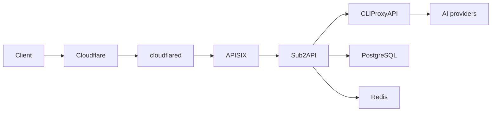

# AI Gateway

Reusable Docker Compose stack for [CLIProxyAPI](https://github.com/router-for-me/CLIProxyAPI), [Sub2API](https://github.com/Wei-Shaw/sub2api), [Apache APISIX](https://apisix.apache.org/), and [Cloudflare Tunnel](https://developers.cloudflare.com/cloudflare-one/networks/connectors/cloudflare-tunnel/).

It separates provider credentials, client API-key authority, public routing, and Internet ingress:



## Security model

- **Sub2API is the only client API-key authority.** APISIX never validates client keys.
- APISIX exposes an AI-method/path allowlist. Management, login, health, and unknown routes are not public.
- Public final `401` and all final `404` responses become the same zero-byte `404`; other statuses and successful, SSE, and WebSocket responses remain transparent.
- APISIX strips Sub2API's private `X-Client-Request-ID` and preserves standard `X-Request-ID` on non-opaque responses.
- CPA, Sub2API admin access, and APISIX bind to loopback by default.
- PostgreSQL, Redis, and Sub2API-to-APISIX traffic use internal Docker networks.
- Cloudflare Tunnel receives its token from the ignored mode-`0600` `.env`, never from tracked Compose or config files.

## Quick start

Requirements: Linux, Docker Engine with Compose v2, OpenSSL, and a remotely managed Cloudflare Tunnel.

```bash
git clone https://github.com/xz-dev/AI-gateway.git
cd AI-gateway
./scripts/init.sh
```

`init.sh` generates private values without printing them. It refuses to overwrite an existing `.env` or `cpa/config.yaml`.

1. Replace `ADMIN_EMAIL=admin@example.invalid` in `.env`.
2. In Cloudflare Dashboard, create a remotely managed Tunnel and replace `CLOUDFLARED_TUNNEL_TOKEN` in `.env` using an editor that does not expose it in shell history. Keep `.env` mode `0600`.
3. Validate and start:

   ```bash
   ./scripts/validate.sh
   docker compose pull
   docker compose up -d
   docker compose ps
   ```

## Cloudflare Tunnel

Create a Public Hostname in Cloudflare Dashboard with this origin service:

```text
http://apisix:9080
```

Do not point the Tunnel directly at Sub2API or CPA. Configure a Cache Rule that bypasses cache for the API hostname. Cloudflare-side changes remain operator-owned; this repository stores no account ID, tunnel ID, hostname, or token.

The Compose service uses Cloudflare's supported `TUNNEL_TOKEN` environment variable. This is portable across Docker Compose implementations and avoids an unreadable UID-mismatched file secret. Docker daemon administrators can inspect container environments, so protect daemon access as root-equivalent. No local `cloudflared` ingress file is needed because hostname routing is managed in Cloudflare Dashboard.

## Configure CPA and Sub2API

CPA listens at `http://127.0.0.1:8317` by default. Its management UI/API requires the private `CPA_MANAGEMENT_KEY` stored in `.env`. OAuth callback ports are also loopback-only. Use SSH port forwarding rather than changing them to `0.0.0.0` on a remote host.

Add provider accounts to CPA, then create an OpenAI-compatible upstream account in Sub2API:

| Field | Value |
| --- | --- |
| Base URL | `http://cli-proxy-api:8317/v1` |
| API key | private `CPA_API_KEY` value from `.env` |

Sub2API admin UI is available at `http://127.0.0.1:8086`. For remote administration:

```bash
ssh -L 8086:127.0.0.1:8086 user@gateway-host
```

To retain direct Sub2API access over Tailscale, set `SUB2API_BIND_ADDRESS` to the host's specific Tailscale IP. Avoid `0.0.0.0` unless every host interface is intentionally trusted.

## Public API behavior

APISIX forwards the supported OpenAI, Anthropic, Gemini, Codex, Antigravity, image, audio, video, realtime, and compatible root routes defined in [`apisix/apisix.yaml`](apisix/apisix.yaml).

Opaque responses are protocol-correct:

- HTTP/1.1 may retain transport framing such as `Connection` and `Transfer-Encoding` while sending zero body bytes.
- HTTP/2 and HTTP/3 do not expose HTTP/1.1 framing headers.
- Content, authentication, product, application, and request-ID headers are removed from opaque `404` responses.

When upgrading Sub2API, re-audit that provider/upstream authentication failures are translated before reaching APISIX; otherwise the final-`401` masking rule could hide an upstream outage. Revalidate header filtering after every APISIX/OpenResty upgrade.

## Operations

```bash
# Logs
docker compose logs -f sub2api apisix cloudflared

# Recreate only public boundary after APISIX config changes
docker compose up -d --no-deps --force-recreate apisix

# Stop without deleting data
docker compose down
```

Persistent state lives under `data/` and is ignored by Git. Back it up before upgrades. Never commit `.env`, `cpa/config.yaml`, CPA auth files, or Sub2API database data.

## Validation

```bash
./scripts/validate.sh              # private runtime config after init
./scripts/validate.sh .env.example # tracked template only
```

Validation renders Compose, checks that private paths are untracked, runs APISIX's own config test with the selected image, and runs ShellCheck when available.

## Layout

```text
.
├── apisix/
│   ├── apisix.yaml       # standalone routes and public response policy
│   └── config.yaml       # APISIX data-plane configuration
├── cpa/
│   └── config.example.yaml
├── scripts/
│   ├── init.sh
│   └── validate.sh
├── .env.example
└── compose.yaml
```

## License

This deployment template is licensed under the [MIT License](LICENSE). Container images and upstream applications retain their own licenses.
