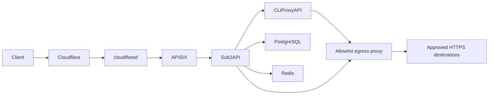

# AI Gateway

Reusable Docker Compose stack for [CLIProxyAPI](https://github.com/router-for-me/CLIProxyAPI), [Sub2API](https://github.com/Wei-Shaw/sub2api), [Apache APISIX](https://apisix.apache.org/), [Squid](https://www.squid-cache.org/), and [Cloudflare Tunnel](https://developers.cloudflare.com/cloudflare-one/networks/connectors/cloudflare-tunnel/).

It separates provider credentials, client API-key authority, public routing, and Internet ingress:



## Security model

- **Sub2API is the only client API-key authority.** APISIX never validates client keys.
- APISIX exposes an AI-method/path allowlist. Management, login, health, and unknown routes are not public.
- APISIX admits 10 requests/second per client with a 40-request burst and at most 50 concurrent requests; excess traffic receives an immediate neutral `429` without delay.
- Request bodies are capped at 16 MiB and rejected with a neutral `413` before reaching Sub2API.
- Public final `401` and all final `404` responses become the same zero-byte `404`; other statuses and successful, SSE, and WebSocket responses remain transparent.
- APISIX strips Sub2API's private `X-Client-Request-ID` and preserves standard `X-Request-ID` on non-opaque responses.
- Sub2API accepts forwarded client IPs only from APISIX. Its URL allowlist stays disabled because CPA uses an internal HTTP URL; Docker pairwise networks provide the service-reachability boundary instead.
- CPA, Sub2API admin access, and APISIX bind to loopback by default.
- Every required service-to-service edge has its own explicit two-member internal network; no service uses Compose's default network. CPA, Sub2API, and APISIX share networking with minimal Alpine namespace owners that hold the existing host publications. Each owner deletes all default routes and drops to `nobody` with zero effective capabilities; each application wrapper independently waits until `/proc` confirms no default route. This keeps the same Compose portable across rootless Podman and rootful Docker without host firewall changes or Docker-specific bridge options.
- CPA and Sub2API have no direct Internet route. Each reaches the same Squid process over a different internal network/listener and policy. Squid alone joins `proxy-egress`; cloudflared alone joins its separate egress network. APISIX has no Internet route.
- Production-only services such as ZCode stay out of the reusable Compose file. An ignored `compose.override.yaml` may add the official digest-pinned ZCode image behind a digest-pinned `tun2proxy` sidecar. ZCode shares that sidecar's network namespace, TUN routes, and virtual DNS, so even transports that ignore proxy variables reach Squid by hostname without a downstream ZCode fork. The sidecar and Squid/CPA peers still form dedicated two-member internal networks.
- Egress policy is fail-closed. Every HTTPS tunnel must pass service/source, CONNECT domain, exact ClientHello SNI-to-CONNECT matching, and resolved private/reserved-address denial. Squid resolves only through an in-container Unbound instance that strips unsafe answers before caching, including mixed and rebinding responses. `bump` destinations additionally require exact decrypted Host-to-SNI matching plus method/path ACLs. `splice` destinations retain end-to-end TLS fingerprints but cannot expose encrypted Host/path to Squid.
- TLS inspection uses a locally generated CA. Its private key is mounted only into Squid; CPA, Sub2API, and optional ZCode receive only a public trust bundle. Upstream certificate validation remains enabled.
- Every external runtime image is pinned by manifest digest; upgrades require an explicit digest change. Every container has PID, memory, CPU, capability, and log-size bounds. Root filesystems are read-only where runtime evidence showed no required overlay writes; APISIX and Sub2API retain writable roots for generated configuration and request handling.
- Cloudflare Tunnel receives its token from the ignored mode-`0600` `.env`, never from tracked Compose or config files.

## Quick start

Requirements: Linux with `/dev/net/tun`, Docker Engine with Compose v2.33.1+ for production or rootless Podman with a Compose provider for local operation, OpenSSL, and a remotely managed Cloudflare Tunnel. The same Compose uses only container-local shared namespaces, temporary route-setup capabilities, virtual DNS, and the TUN device; it never changes host firewall or routing state.

```bash
git clone https://github.com/xz-dev/AI-gateway.git /root/AI-gateway
cd /root/AI-gateway
./scripts/init.sh
```

`init.sh` generates private values without printing them. It refuses to overwrite an existing `.env` or `data/cpa/conf/config.yaml`.

1. Replace `ADMIN_EMAIL=admin@example.invalid` in `.env`.
2. In Cloudflare Dashboard, create a remotely managed Tunnel and replace `CLOUDFLARED_TUNNEL_TOKEN` in `.env` using an editor that does not expose it in shell history. Keep `.env` mode `0600`.
3. Add the minimum required destinations to `data/egress-proxy/policy.json`, then render it:

   ```bash
   ./scripts/init-egress-proxy.sh
   ```

   The generated policy initially denies all egress. Use `tls: "bump"` with explicit methods and anchored POSIX path expressions. Use `tls: "splice"` only when preserving end-to-end TLS behavior is required; splice entries cannot enforce HTTP Host/path.
4. Validate and start:

   ```bash
   ./scripts/validate.sh
   docker compose pull cli-proxy-api postgres redis sub2api apisix cloudflared
   docker compose up -d --build --wait
   docker compose ps
   ```

   On rootless Podman installations without automatic healthcheck scheduling (for example OpenRC), use the same Compose with `docker compose up -d --build`; do not use `--wait`. `./scripts/validate.sh` performs explicit runtime probes instead of relying on engine health timers.

## Cloudflare Tunnel

Create a Public Hostname in Cloudflare Dashboard with this origin service:

```text
http://apisix:9080
```

Do not point the Tunnel directly at Sub2API or CPA. Configure a Cache Rule that bypasses cache for the API hostname. Cloudflare-side changes remain operator-owned; this repository stores no account ID, tunnel ID, hostname, or token.

The Compose service uses Cloudflare's supported `TUNNEL_TOKEN` environment variable. This is portable across Docker Compose implementations and avoids an unreadable UID-mismatched file secret. Docker daemon administrators can inspect container environments, so protect daemon access as root-equivalent. No local `cloudflared` ingress file is needed because hostname routing is managed in Cloudflare Dashboard.

## Configure egress policy

Example bumped destination:

```json
{
  "domain": "api.example.com",
  "tls": "bump",
  "methods": ["POST"],
  "paths": ["^/v1/responses($|[?])"]
}
```

Example TLS-preserving destination:

```json
{
  "domain": "subscription.example.com",
  "tls": "splice"
}
```

Domain entries may be exact names or start with `.` to include subdomains. A domain may have multiple `bump` entries when different paths require different methods, but it cannot mix `bump` and `splice`. IP literals, plaintext HTTP, missing SNI, CONNECT ports other than 443, unlisted redirects, unknown methods/paths, private/link-local/loopback/CGNAT/documentation/multicast/reserved destinations, and malformed upstream certificates fail closed. Re-run `./scripts/init-egress-proxy.sh` after every policy edit, then validate and recreate Squid with its dependent clients together.

## Configure CPA and Sub2API

CPA listens at `http://127.0.0.1:8317` by default. Its management UI/API requires the private `CPA_MANAGEMENT_KEY` stored in `.env`. OAuth callback ports are also loopback-only. Use SSH port forwarding rather than changing them to `0.0.0.0` on a remote host.

CPA's global `proxy-url` forces provider transports through Squid. If an OpenAI-compatible entry targets another service on a pairwise internal network, set that entry's `api-key-entries[].proxy-url` to `direct`; otherwise the global proxy would incorrectly receive the internal HTTP request. Do not use `direct` for Internet destinations—the CPA container has no direct Internet route.

Add provider accounts to CPA, then create an OpenAI-compatible upstream account in Sub2API:

| Field | Value |
| --- | --- |
| Base URL | `http://cli-proxy-api:8317/v1` |
| API key | private `CPA_API_KEY` value from `.env` |

Leave that internal CPA account without a Sub2API proxy. For every Sub2API account whose Base URL is on the Internet, explicitly assign an active `http` proxy record pointing to `172.24.0.3:3128` with fallback mode `none`; Sub2API's account transports do not consistently inherit proxy environment variables.

### Production-only ZCode

Do not maintain a downstream ZCode branch. Pin the official release image by manifest digest in the ignored `.env` and create the ignored production override with `./scripts/init-zcode-override.sh`. The override uses a `zcode-egress-tunnel` namespace owner based on the pinned `TUN2PROXY_IMAGE`, with `network_mode: service:zcode-egress-tunnel` on ZCode. The tunnel receives only `/dev/net/tun` and `NET_ADMIN`; it is not privileged and never changes host firewall or routing state.

Use `--dns virtual` and mount an ignored `data/egress-proxy/virtual-resolv.conf` containing only:

```text
nameserver 198.18.0.1
options ndots:0
```

Virtual DNS preserves the requested hostname for Squid CONNECT while preventing client-side DNS escape. Both the ZCode/CPA and ZCode/Squid networks remain `internal: true`; a failed or bypassed tunnel therefore loses connectivity instead of gaining direct Internet access. The validator requires official digest-pinned ZCode and tun2proxy images, the shared namespace, virtual-DNS health, the dedicated network aliases/addresses, and public-CA-only trust.

For the CPA entry targeting `http://zcode-proxy:8080/v1`, set that entry's `proxy-url` to `direct`; the global CPA proxy is only for Internet destinations.

Sub2API admin UI is available at `http://127.0.0.1:8086`. For remote administration:

```bash
ssh -L 8086:127.0.0.1:8086 user@gateway-host
```

To retain direct Sub2API access over Tailscale, set `SUB2API_BIND_ADDRESS` to the host's specific Tailscale IP. Avoid `0.0.0.0` unless every host interface is intentionally trusted.

## Public API behavior

APISIX forwards the supported OpenAI, Anthropic, Gemini, Codex, Antigravity, image, audio, video, realtime, and compatible root routes defined in [`apisix/apisix.yaml`](apisix/apisix.yaml).

Opaque responses are protocol-correct:

- HTTP/1.1 may retain transport framing such as `Connection` and `Transfer-Encoding` while sending zero body bytes.
- HTTP/2 and HTTP/3 do not expose HTTP/1.1 framing headers.
- Content, authentication, product, application, and request-ID headers are removed from opaque `404` responses.

When upgrading Sub2API, re-audit that provider/upstream authentication failures are translated before reaching APISIX; otherwise the final-`401` masking rule could hide an upstream outage. Revalidate header filtering after every APISIX/OpenResty upgrade.

## Operations

Sub2API and CLIProxyAPI are one operational unit. Restart commands do not reliably cascade, so every restart, stop/start, or recreation must name both applications. Never use `docker restart cli-proxy-api` or recreate only CPA: isolated CPA replacement can leave Sub2API returning `503` for a long time. Namespace owners are a second boundary: never recreate `cpa-netns`, `sub2api-netns`, `apisix-netns`, or `zcode-egress-tunnel` without also recreating the application that shares it. With the production override, always handle the tunnel, ZCode, CPA, and Sub2API as one unit.

```bash
# Logs
docker compose logs -f egress-proxy cli-proxy-api sub2api apisix cloudflared

# Restart CPA and Sub2API together
docker compose restart cli-proxy-api sub2api

# Production override: include the namespace owner and ZCode
docker compose restart zcode-egress-tunnel zcode-proxy cli-proxy-api sub2api

# Recreate the coupled pair together
docker compose up -d --wait --force-recreate cli-proxy-api sub2api

# Production override: recreate the complete coupled unit
docker compose up -d --wait --force-recreate zcode-egress-tunnel zcode-proxy cli-proxy-api sub2api

# Apply a new egress policy to the reusable stack
docker compose up -d --build --wait --force-recreate egress-proxy cli-proxy-api sub2api

# Production override with ZCode: recreate the namespace owner and coupled clients together
docker compose up -d --build --wait --force-recreate egress-proxy zcode-egress-tunnel zcode-proxy cli-proxy-api sub2api

# Recreate only public boundary after APISIX config changes
docker compose up -d --wait --no-deps --force-recreate apisix

# Stop and restart the complete stack without deleting bind-mounted data
docker compose down
docker compose up -d --build --wait
```

Persistent application state lives under ignored `data/`, including the egress CA/policy, CPA config/auth/logs/plugins/runtime SQLite, and Sub2API PostgreSQL/Redis/application data. Back it up before upgrades. Never commit `.env` or `data/`. Losing the egress CA breaks trust for bumped destinations; never rotate it as part of a routine redeploy.

## Validation

```bash
./scripts/validate.sh              # private runtime config after init
./scripts/validate.sh .env.example # tracked template only
```

Validation renders Compose, enforces exact pairwise network membership, fixed internal addresses, engine-neutral host publication, startup wrappers, image digests, and sole-egress membership with no default network. It checks private CA/runtime files and the rendered production Squid configuration, then runs filtered DNS, SSL-Bump Host/method/path, official ZCode/TUN failure, and namespace-owner host-publication/direct-egress tests under the current container runtime. It also runs APISIX's config test and ShellCheck when available.

## Layout

```text
.
├── apisix/
│   ├── apisix.yaml       # standalone routes and public response policy
│   ├── config.yaml       # APISIX data-plane configuration
│   └── lua/              # production custom Lua modules
├── cpa/
│   └── config.example.yaml
├── egress-proxy/
│   ├── Dockerfile
│   ├── unbound.conf         # filtered resolver used only by Squid
│   ├── policy.example.json # copied as a deny-all runtime policy
│   └── testdata/
├── data/                   # ignored persistent runtime state
│   ├── cpa/
│   ├── egress-proxy/
│   └── sub2api/
├── scripts/
│   ├── init.sh
│   ├── init-egress-proxy.sh
│   ├── init-zcode-override.sh
│   ├── render-egress-policy.py
│   ├── test-egress-proxy.sh
│   ├── test-netns-guard.sh
│   └── validate.sh
├── .env.example
└── compose.yaml
```

## License

This deployment template is licensed under the [MIT License](LICENSE). Container images and upstream applications retain their own licenses.
